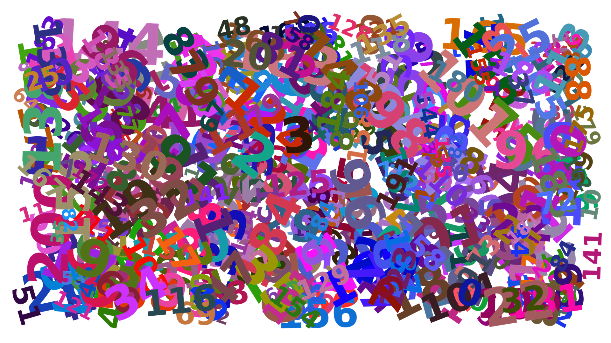
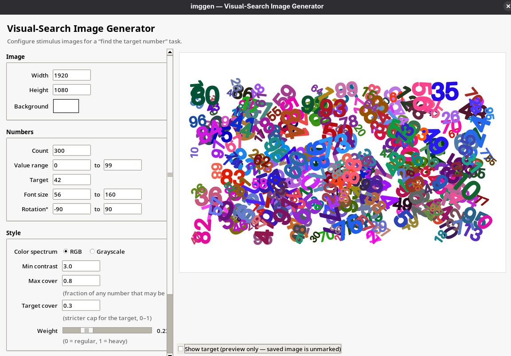

# imggen — Visual-Search Image Generator

Generate "Where's Waldo?"-style images filled with numbers for visual-search
psychology experiments. Each image hides one configured **target** number among
many distractors, with controllable size, color, rotation, overlap, and more.



Two ways to use it:

- **GUI** (`gui.py`) — point-and-click, live preview, Save Image button.
- **CLI** (`script.py`) — reads a JSON config, writes a PNG. Useful for batch
  generation.

## Contents

- [Quick start (macOS)](#quick-start-macos)
- [Quick start (Linux / Windows)](#quick-start-linux--windows)
- [Using the app](#using-the-app)
- [CLI usage](#cli-usage)
- [Troubleshooting](#troubleshooting)
- [Notes on academic use](#notes-on-academic-use)
- [Files](#files)
- [Contributing](#contributing)
- [License](#license)

## Quick start (macOS)

1. **Install Python 3** from <https://www.python.org/downloads/macos/>. The
   official installer ships with Tk, which the GUI needs. (If you already
   have Python from Homebrew and you get a "no module named tkinter" error,
   run `brew install python-tk`.)

2. **Get the code.** Either click the green "Code" button on GitHub →
   *Download ZIP* and unzip into a folder you can find (e.g. your Desktop),
   or `git clone` it.

3. **Open Terminal and navigate to the folder.** This is the part that's
   easy to miss if you've never used a terminal before. Open the Terminal
   app (Cmd+Space → "Terminal" → Enter), then type:

   ```bash
   cd ~/Desktop
   cd visual-search-image-gen
   ```

   (Replace `visual-search-image-gen` with the actual folder name if it
   differs, and replace `~/Desktop` with wherever you put it — e.g.
   `~/Downloads` if it's still in your Downloads folder.) After each
   command press Enter. You can confirm you're in the right place by
   typing `ls` — you should see `gui.py`, `script.py`, `README.md`, etc.

4. **Install the dependencies (first time only):**

   ```bash
   python3 -m pip install "Pillow>=10.1" numpy
   ```

5. **Launch the GUI:**

   ```bash
   python3 gui.py
   ```

> **Second run and onwards:** skip step 4. The dependencies are already
> installed. Just open Terminal, do step 3 (`cd`), then step 5
> (`python3 gui.py`).

Set parameters on the left, click **Generate** to preview, click
**Save Image…** to write a PNG.

### Optional: a double-clickable launcher

If you'd rather not open Terminal each time, save a file called
`imggen.command` next to `gui.py` containing:

```bash
#!/bin/bash
cd "$(dirname "$0")"
python3 gui.py
```

Then in Terminal, run `chmod +x imggen.command` once. After that you can
double-click `imggen.command` from Finder to start the app.

## Quick start (Linux / Windows)

Same as above — install Python 3, `pip install "Pillow>=10.1" numpy`, run
`python3 gui.py`. Tk is bundled with the standard Python distributions.

## Using the app



The form on the left is grouped into Image, Numbers, Style, and Output
sections; tooltips and inline hints describe each field. Click **Generate**
to render a preview, **Save Image…** to write a PNG. The form column scrolls
if your display is short.

Below the preview there is a **Show target** toggle that highlights the
target's location with a red ring — useful when you want to verify placement
without playing the game yourself. The marker is preview-only; saved PNGs are
never marked.

## CLI usage

```bash
python3 script.py path/to/config.json
```

Example `config.json`:

```json
{
  "width": 1920,
  "height": 1080,
  "color_spectrum": "rgb",
  "font_size_range": [56, 160],
  "count": 300,
  "value_range": [0, 99],
  "target": 42,
  "rotation_range": [-90, 90],
  "background": [255, 255, 255],
  "min_contrast": 3.0,
  "max_cover_rate": 0.8,
  "target_max_cover_rate": 0.3,
  "weight": 0.5,
  "seed": null,
  "output_path": "out.png"
}
```

All fields except `output_path` and the seven core parameters are optional and
fall back to the defaults shown.

## Troubleshooting

- **"No module named tkinter"** — Tk isn't bundled with your Python.
  On macOS, install Python from python.org, or `brew install python-tk`.
  On Debian/Ubuntu Linux, `sudo apt install python3-tk`.
- **"Pillow >= 10.1 required"** — your installed Pillow is too old.
  Run `python3 -m pip install --upgrade Pillow`.
- **"could not sample color … with contrast"** — the requested
  `min_contrast` is too high for the spectrum + background combo. Either
  pick a darker/lighter background or lower `min_contrast`.
- **"could not place number …"** — for very crowded layouts (high `count`,
  small canvas, low `max_cover_rate`), some placements may be dropped. The
  generator logs a warning and continues; the resulting image will contain
  fewer numbers than `count`. Increase the canvas, lower the count, or raise
  `max_cover_rate` to fit more in.

## Notes on academic use

Whether the output is suitable for a peer-reviewed study depends on how tight
your stimulus controls need to be. Honest stocktaking:

### What this tool helps with

- **Reproducibility.** With a fixed `seed`, output is bit-identical — the
  same image regenerates from the same config every time, which is what
  pre-registration and replication need.
- **Independently controllable parameters.** Size, color, count, rotation,
  overlap budget, contrast, target identity, and weight all vary separately,
  so you can hold one fixed while sweeping another.
- **Single target, enforced.** Target uniqueness is implemented in code
  (R10 in [REQUIREMENTS.md](REQUIREMENTS.md)), not assumed.
- **Open source under BSD.** Inspect, fork, or extend the generator; no
  black-box behavior, every rule lives in `script.py`.

### What it doesn't do

- **No per-image metadata sidecar.** The script writes the PNG only — it
  does *not* export target pixel coordinates, per-glyph positions, or a
  record of the parameters used. If your analysis needs that, you'll have
  to add it.
- **No counterbalancing or batch utilities.** Generating a balanced stimulus
  set across conditions is your responsibility — a small shell loop over
  seeds and configs usually does the trick.
- **No empirical validation.** This is a generator, not a validated stimulus
  set. There are no published norms, detection-time baselines, or
  peer-review behind the parameter defaults.
- **Color sampling is naive.** RGB and grayscale spectra sample uniformly
  in their native channels; they are not isoluminant in CIE Lab. Studies
  that control for chromatic vs. luminance contrast will need to
  post-process colors or extend `_sample_color`.
- **`min_contrast` is WCAG luminance contrast**, intended for text
  readability — not a substitute for RMS or Michelson contrast metrics
  used in vision research.
- **`weight` is not real weight** via stroke thickening on a single regular font, not
  a true typographic weight axis. Fine for "looks heavier"; not a faithful
  manipulation of typographic weight as an independent variable.

For pilot studies, methods classes, and exploratory work, the tool stands on
its own. For confirmatory studies, justify your parameter choices in your
methods section and consider extending the pipeline with the controls your
design actually needs — or
[open a GitHub issue](https://github.com/doodek/visual-search-image-gen/issues/new/choose)
and I'll consider adding it.

## Files

- `gui.py` — Tkinter front-end.
- `script.py` — core renderer and CLI.
- `REQUIREMENTS.md` — formal requirement list driving the implementation.
- `CONTRIBUTING.md` — how to file issues and submit PRs.
- `.github/ISSUE_TEMPLATE/` — bug report and feature request templates.
- `img/` — example output and GUI screenshot used in this README.
- `LICENSE` — BSD 3-Clause license.

## Contributing

Bug reports, feature requests, and pull requests are welcome. Open an issue
or PR at <https://github.com/doodek/visual-search-image-gen/issues>; see
[CONTRIBUTING.md](CONTRIBUTING.md) for the short version of how.

## License

BSD 3-Clause. See [LICENSE](LICENSE).
